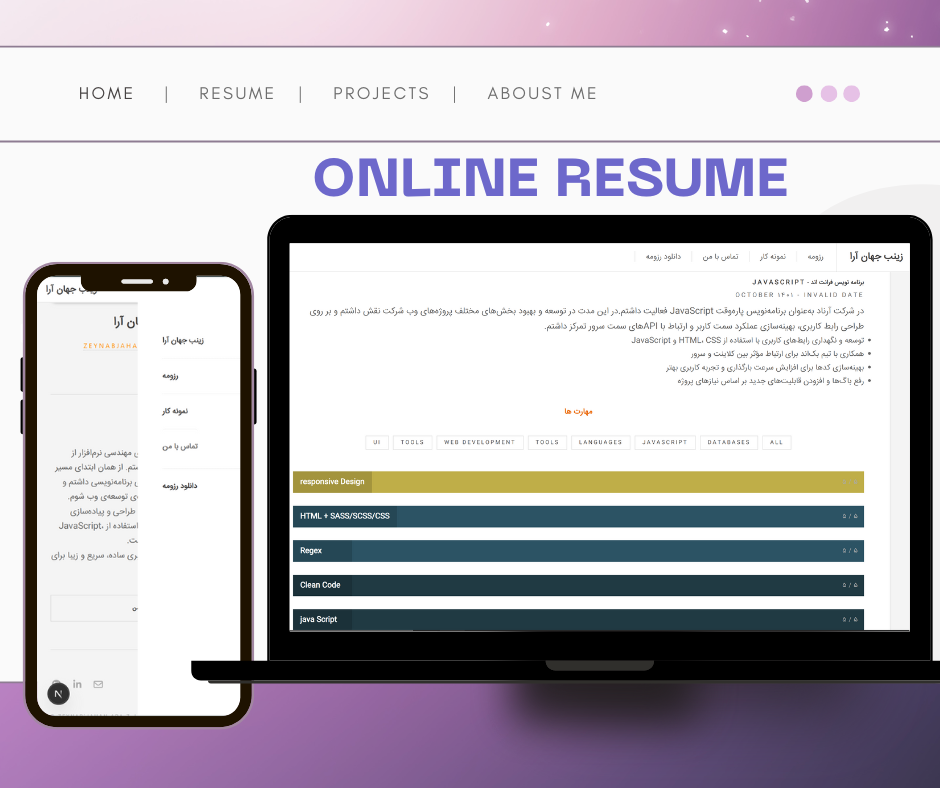

# Personal Portfolio Website


A modern and responsive **personal portfolio website** built with **Next.js**, **React**, and **TypeScript** — showcasing my background, projects, and skills as a front-end developer.

---

## 🚀 Features
- ⚡ **Built with Next.js 14 and TypeScript**
- 🎨 **Responsive design** optimized for all devices
- 🧭 **Smooth navigation and animations**
- 📄 **Downloadable resume**
- 💬 **About section** with personal background and education
- 🧠 **Skills section** with categorized technologies
- 🧩 **Projects showcase** with live links and descriptions

---

## 🛠️ Tech Stack

- **Framework:** [Next.js](https://nextjs.org/)
- **Language:** TypeScript
- **UI Library:** React
- **Styling:** SCSS (Sass)
- **Icons:** React Icons
- **Deployment:** Vercel

---

## 📂 Folder Structure
personal-site/
├── app/ # Next.js app directory
├── components/ # Reusable React components
├── data/ # Static data (routes, skills, etc.)
├── public/ # Static assets (images, favicon, resume.pdf)
├── styles/ # Global SCSS styles
├── package.json
└── README.md


---

## ⚙️ Installation & Development

Clone the repository and run the project locally:

```bash
# Clone this repository
git clone https://github.com/<your-username>/<repo-name>.git

# Go inside the project folder
cd personal-site

# Install dependencies
npm install

# Run the development server
npm run dev

Then open http://localhost:3000
 in your browser.

📦 Build for Production

To create an optimized production build:

npm run build
npm run start


To export a static version (if you want to deploy on GitHub Pages or Netlify):

npm run export

🌐 Deployment

This project is optimized for deployment on Vercel
.

Simply connect your GitHub repository to Vercel, and it will automatically detect and deploy your Next.js project.

📜 License

This project is open-source and available under the MIT License
.

👤 Author

Zeynab JahanAra
Front-End Developer • JavaScript & React Enthusiast
📧 zeynabjahanara80@gmail.com

